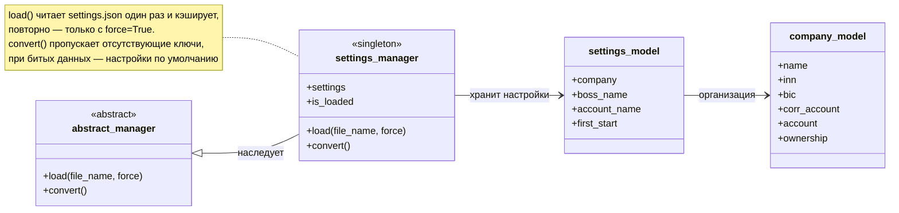
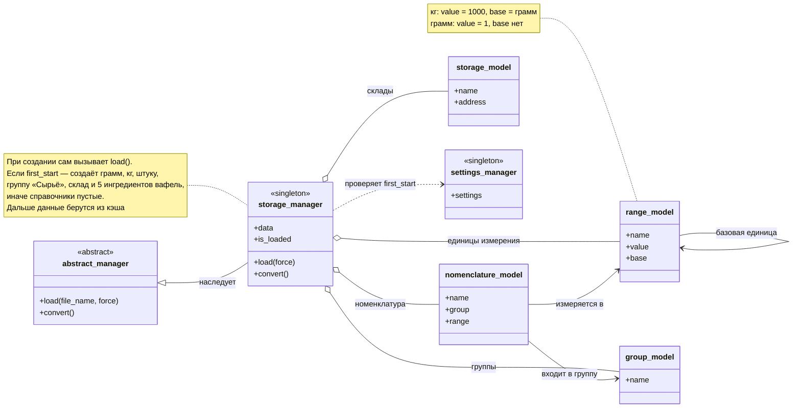

# UML-диаграммы менеджеров

Оба менеджера — singleton: сколько раз ни вызывай конструктор, объект будет один.
И оба кэшируют данные: загрузили один раз — дальше отдают из памяти, пока не попросят `load(force=True)`.
На диаграммах показано только то, чем менеджеры пользуются снаружи — без приватных полей.

## settings_manager

Читает `settings.json` и собирает из него настройки с организацией внутри.

## storage_manager

Хранит справочники. Если в настройках включён `first_start`, при первом обращении сам заполняется ингредиентами из [рецепта](Recipe.md).

